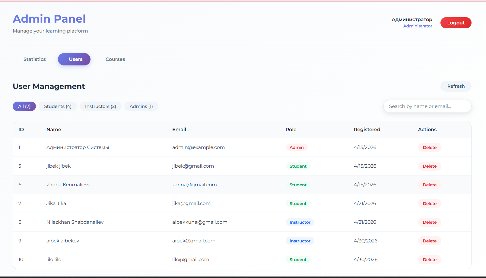

Faculty of Engineering and Informatics  
Department of Computer Engineering  

Student: Makushova Zhibek, Com 22  
Supervisor: Mr. Erustan Erkebulanov  

Project of Specialization: Front-end

# Educational Platform

A web-based educational platform built with React that supports role-based access (Student / Instructor / Admin), course management, assignments, and learning progress tracking.

## Live Demo
https://educational-platform-zfde.onrender.com

## Test Accounts

| Role       | Email             | Password     |
|------------|------------------|--------------|
| Student    | jibek@gmail.com  | **********
| Instructor | aibek@gmail.com  | **********  |
| Admin      | admin@example.com | **********  |

See passwords in thesis / presentation


## Problem

Existing educational platforms in Kyrgyzstan (GeekTech, Codify, Bilim) lack flexibility for instructors and students to create and follow structured courses tailored to local educational needs.

## Solution

The developed platform provides:

- Role-based access (student / instructor / admin)
- Structured course creation
- Assignment and quiz functionality
- Learning progress tracking
- Administrative management tools
- Adaptation to local educational requirements

## Goal

To provide instructors with simple and effective tools for course creation, students with a structured and convenient learning experience, and administrators with full platform oversight.

## Objectives

- Analyze existing platforms and define UI/UX requirements  
- Design component architecture and application structure  
- Implement role-based routing using React Router  
- Develop global state management using Context API  
- Integrate REST API using Axios  
- Implement local storage for progress tracking and notes  
- Ensure responsive design across devices  
- Implement admin panel for user and course management  
- Deploy the application  

## Technology Stack

- React 19  
- React Router DOM  
- Axios  
- jwt-decode  
- Vite  
- CSS  
- ESLint  
- Render (Deployment)  

## Installation and Local Setup

### Prerequisites

- Node.js (v18 or higher)  
- npm or yarn  

### Steps

```bash
git clone https://github.com/weyxou/educational-platform
cd educational-platform
npm install
npm run dev
```

## Features

### Student
- Browse and enroll in courses
- View lessons (text, video, PDF, images)
- Submit assignments
- Track grades and feedback
- Mark lessons as completed
- Save personal notes per lesson
- Continue learning from last incomplete lesson
- Progress tracking stored in localStorage

### Instructor
- Create, edit, delete courses
- Create, edit, delete lessons
- Upload media files (images, videos, PDFs)
- Set lesson order
- Create and delete assignments
- View enrolled students
- Review student submissions
- Assign grades (0–100) and provide feedback

### Administrator
- View all platform users
- Delete any user (student, instructor)
- View all courses across the platform
- Delete any course
- View system statistics dashboard (total users, courses, lessons, assignments)
- Full platform oversight and moderation

### General
- Responsive design (mobile, tablet, desktop)
- Notifications system (toasts and confirmation dialogs)
- JWT authentication

## Screenshots

### Register Page


### Login Page


### Student Lesson Page


### Instructor Panel


### Admin Panel


## Project Structure

```
.
├── public/
│   ├── images/
│   └── vite.svg
│
├── src/
│   ├── api/            # API requests
│   ├── assets/         
│   ├── common/         # Shared logic
│   ├── components/     # Reusable UI components
│   ├── context/        # Global state (Context API)
│   ├── layout/         # Layout components
│   ├── pages/
│   │   ├── admin/      # Admin panel components
│   │   ├── instructor/ # Instructor dashboard
│   │   └── student/    # Student pages
│   ├── utils/
│   ├── App.jsx
│   ├── main.jsx
│   └── index.css
│
├── index.html
└── package.json
```

## API Endpoints

| Method | Endpoint | Description | Access |
|--------|----------|-------------|--------|
| POST | /auth/login | User authentication | All |
| POST | /auth/signup | User registration | All |
| GET | /course/all_courses | Get all courses | All |
| POST | /course/add_course | Create course | Instructor |
| GET | /lesson/get_all_lessons/{id} | Get course lessons | Student/Instructor |
| POST | /assignment/add_assignment | Create assignment | Instructor |
| GET | /admin/users | Get all users | Admin |
| DELETE | /admin/users/{id} | Delete user | Admin |
| GET | /admin/courses | Get all courses | Admin |
| DELETE | /admin/courses/{id} | Delete course | Admin |
| GET | /admin/statistics | Get system statistics | Admin |

## Deployment Notes

The application is deployed on **Render** using a free-tier hosting service. Due to this:

- After a period of inactivity, the server may suspend automatically
- Initial load may take 30–60 seconds (cold start)
- A page refresh may be required after the server resumes

This behavior is expected for free-tier hosting and does not affect local development or core functionality.

## Acknowledgements

Special thanks to Mr. Erustan Erkebulanov for guidance and support throughout this project.

## Contact

GitHub: https://github.com/weyxou  
Email: nurzhibek.makushova@alatoo.edu.kg